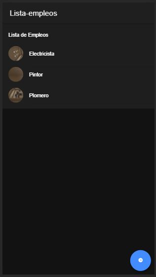
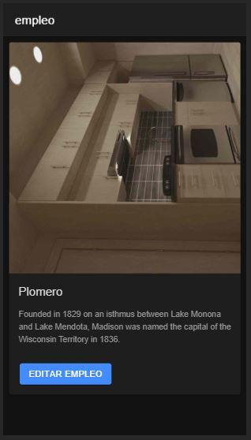
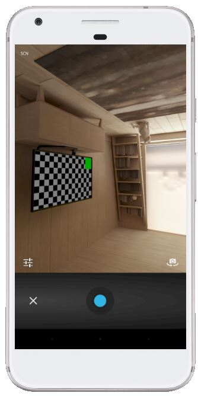
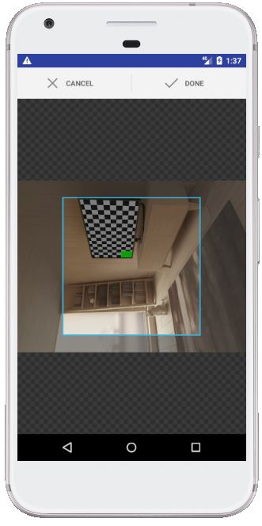

# appEmpleos

Se agrega el plugin para captura de imágenes por medio de la cámada del dispositivo, y se almacenan en cada empleo. 
Las imágenes se visualizan en la lista de empleos como avatar, y en el detalle de cada empleo

 

# Componente image-crop

Permite acceder a la cámara, tomar una fotografía, y recortarla en una escala 1:1 para subirla al storage de Firebase 

 

## Instalación

Es necesario instalar 4 APIs nativos para ionic de la página https://ionicframework.com/docs/native
1. Camera \ 
   **enlace:** https://ionicframework.com/docs/native/camera \
   **instalación para capacitor:**\
    $ npm install cordova-plugin-camera \
    $ npm install @ionic-native/camera \
    $ ionic cap sync
2. Crop \
   **enlace:** https://ionicframework.com/docs/native/crop \
   **instalación para capacito:r**\
    $ npm install cordova-plugin-crop \
    $ npm install @ionic-native/crop \
    $ ionic cap sync
3. File \
  **enlace:** https://ionicframework.com/docs/native/file \
  **instalación para capacitor:**\
    $ npm install cordova-plugin-file \
    $ npm install @ionic-native/file \
    $ ionic cap sync
4. Base64 \
  **enlace:** https://ionicframework.com/docs/native/base64 \
  **instalación para capacitor:**\
    $ npm install com-badrit-base64 \
    $ npm install @ionic-native/base64 \
    $ ionic cap sync
  
## Agregar Providers

Se deben agregar los providers en el **app.module.ts**
```javascript
import {Camera} from '@ionic-native/camera/ngx';
import { Crop } from '@ionic-native/crop/ngx';
import { File } from '@ionic-native/file/ngx';
import { Base64 } from '@ionic-native/base64/ngx';

providers: [
    ...
    Camera,
    Crop,
    File,
    Base64,
   ...
  ]...
```

## Implementación 

Para crear el componente se debe ingresar el siguiente comando dentro de la carpeta del proyecto:\
ionic gereate component <ruta para los componentes>/image-crop

**iamge-crop.component.html**
```html
<ion-button size="small" (click)="captureAndUpload()">
    <ion-icon [name]="icon"></ion-icon>Crop
</ion-button>
```
**image-crop.component.ts**
```javascript
import { Component, OnInit, Input, Output, EventEmitter } from '@angular/core';

import { Camera, CameraOptions } from '@ionic-native/camera/ngx';
import { Crop } from '@ionic-native/crop/ngx';
import { File } from '@ionic-native/file/ngx';
import { Base64 } from '@ionic-native/base64/ngx';

import { AngularFireStorage } from '@angular/fire/storage';
import { LoadingController } from '@ionic/angular';
import { tap, finalize, filter } from 'rxjs/operators';

@Component({
  selector: 'app-image-crop',
  templateUrl: './image-crop.component.html',
  styleUrls: ['./image-crop.component.scss'],
})
export class ImageCropComponent implements OnInit {
  
  @Input() type:string;
  @Input() icon:string;
  @Output() uploadFinished = new EventEmitter<any>();
  
  constructor(private camera: Camera,
    private crop: Crop,
    private file: File,
    private base64: Base64,
    private storage: AngularFireStorage,
    private loadingCtrl: LoadingController) { }

  ngOnInit() {}

  captureAndUpload(){
    console.log("camera");
    const options: CameraOptions = {
      quality: 100,
      destinationType: this.camera.DestinationType.FILE_URI,
      encodingType: this.camera.EncodingType.JPEG,
      mediaType: this.camera.MediaType.PICTURE,
      sourceType: this.type=='camera'?this.camera.PictureSourceType.CAMERA:this.camera.PictureSourceType.PHOTOLIBRARY
    } 

    this.camera.getPicture(options).then(url => {
      this.cropImage(url);
    })
  }

  async cropImage(url: string) {
    
    let options = {
      quality: 100,
      targetHeight: 100,
      targetWidth: 100
    };

    this.crop.crop(url, options).then(uri => {
      this.file.resolveLocalFilesystemUrl(uri).then((newUrl) => {
        let dirPath = newUrl.nativeURL;
        this.base64.encodeFile(dirPath).then((base64File: string) => {
          console.log(base64File);
          this.startUpload(base64File);
        }, (err) => {
          alert(err);
        })
      })
    })
  }

  async startUpload(file: string){
    file = file.substring(34, file.length);
    console.log(file);
    let byteCharacters = atob(file);
    console.log("byteCharacters");
    const path = `adjuntos/imgs/${new Date().getTime()}`;
    console.log("path");
   
    let image = 'data:image/jpg;base64,'+file;
    console.log(image);
    const data = {
      ref: path,
      type: 'image',
      url: null,
      name: 'image',
      size: this.fileSize(Number(byteCharacters.length))
    }

    try{
      let ref = this.storage.ref(path);
      
      let task = ref.putString(image, 'data_url');
    
      console.log("ref 2");
      const loading = await this.loadingCtrl.create({
        message: 'Espere, subiendo fotografía...'
      });  
      await loading.present(); 

      //Listener de progreso de carga
      task.percentageChanges().pipe(
        filter(val => val === 100),
        tap(complete => {
          setTimeout(() => {
            loading.dismiss();
          }, 3500);
        })
      ).subscribe();

      task.snapshotChanges().pipe(
        finalize(() => {
          let downloadURL = ref.getDownloadURL()
          downloadURL.subscribe(url => {
            data.url= url;
            console.log("donload terminado "+ url);
            this.uploadFinished.emit(data);
          });
        })
      )
      .subscribe();
    }catch(error){
      alert(JSON.stringify(error));
      console.error("error ");

    }
    
  }

  /**
   * Redondea un número de bytes a un tamaño legible
   * @param sizeInBytes Número de bytes
   */
  fileSize(sizeInBytes: number) {
    const units = ['B', 'KB', 'MB', 'GB', 'TB', 'PB', 'EB', 'ZB', 'YB'];
    let power = Math.round(Math.log(sizeInBytes) / Math.log(1024));
    power = Math.min(power, units.length - 1);

    const size = sizeInBytes / Math.pow(1024, power); // size in new units
    const formattedSize = Math.round(size * 100) / 100; // keep up to 2 decimals
    const unit = units[power];

    return size ? `${formattedSize} ${unit}` : '0';
  }

}
```

## Uso 

El componente se puede agregar en cualquier página html de la siguiente forma: 
**página.html**
```html
<app-image-crop [icon]="'camera'" [type]="'camera'" (uploadFinished)="imagenCargada($event)"></app-image-crop>
```

**página.module.ts**
```javascript
...
import { ImageCropComponent } from 'src/app/components/image-crop/image-crop.component';

@NgModule({
  imports: [
    ...
  ],
  declarations: [..., ImageCropComponent],
  exports: [..., ImageCropComponent]
})
```

**página.page.ts**
```javascript
export class Página implements OnInit {
  ...
  constructor() {}
  ngOnInit() {
  }
  imagenCargada(imagen) {
    console.log("imagen cargada");
    console.log(JSON.stringify(imagen));
  }
  ...
}
```


